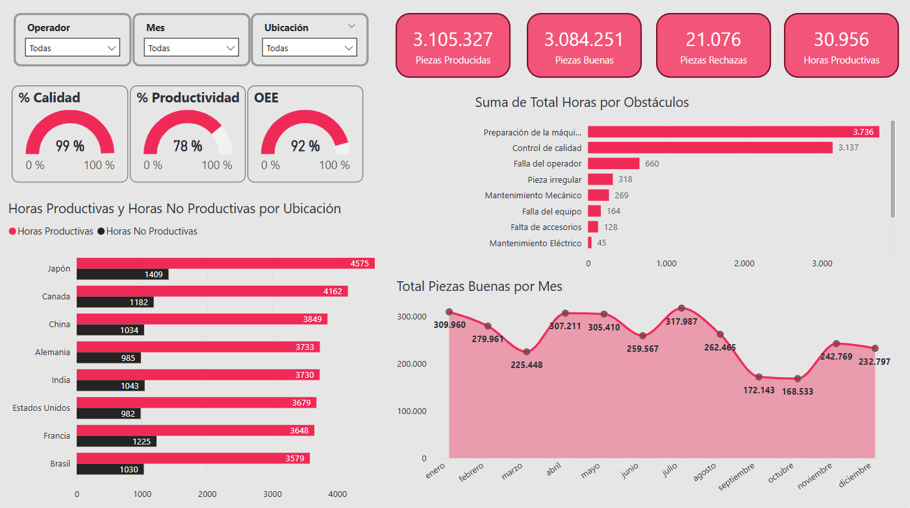

# 🏭 Dashboard de Producción con Power BI

## 📌 Descripción del Proyecto
Dashboard interactivo desarrollado en Power BI para monitorear el rendimiento fabril global, identificando oportunidades de optimización en:
- ✅ **Eficiencia (OEE)** 
- ⏱️ **Tiempos productivos**
- 🚧 **Cuellos de botella**
- 🌍 **Desempeño por país/site**

## 📊 Métricas Clave
| Indicador | Valor |
|-----------|-------|
| 🏭 Piezas producidas | 3.1M |
| 🎯 Calidad | 99% |
| ⚙️ Productividad | 78% |
| 🚀 OEE | 92% |

## 🔍 Hallazgos Destacados
- **Top 3 países**: Japón, Canadá y China (mayor eficiencia en horas productivas)  
- **Principales obstáculos**:  
  - Preparación de máquina (25%)  
  - Control de calidad (20%)  
  - Fallas operarias (15%)  
- **Estacionalidad**: Picos de producción en diciembre/enero (Japón)  

## 🛠️ Recursos Técnicos
- **Power BI**: 
  - [Archivo .pbix](powerbi_produccion.pbix) (incluye transformaciones con Power Query)
  - [Video demostrativo](https://drive.google.com/file/d/1YwbldrUVZFrbXCyAS9VoZ4pMSpT6jNEW/view?usp=drive_link)
- **Dataset**:  
  - [Datos crudos](dasaset_produccion.xlsx)  
  - [Datos procesados](datos_procesados.xlsx)  

## 📢 Publicación Relacionada

## 👩💻 Autora
**Romina Abud**  
*"Transformando datos en decisiones estratégicas"*  

